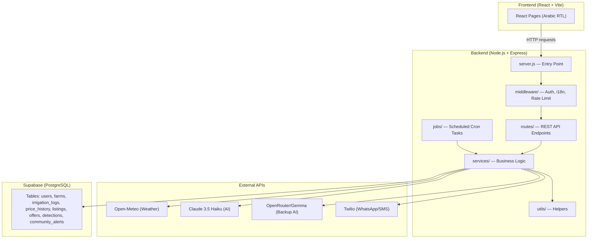
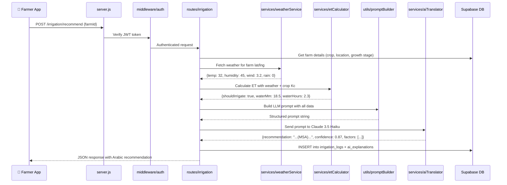

# 🌍 Filaha — Complete Project Workflow Walkthrough

## What Is Filaha?

Filaha is a **dual-sided AI platform** for African smallholder farmers. It has two "brains":

| Brain | Name | Purpose |
|-------|------|---------|
| 🚿 Irrigation Intelligence | **MAÏ** | Tells the farmer **when** and **how much** to water (uses weather + FAO-56 crop science) |
| 💰 Market Intelligence | **SILA** | Tells the farmer **when to sell**, at **what price**, and matches them with **buyers** |

There are also two types of users:
- **Farmers (B2C)** — login via phone + OTP, use MAÏ + SILA
- **Distributors (B2B)** — login via email + password, browse listings and make offers

---

## High-Level Architecture



---

## The Build Order — What To Code First

> [!IMPORTANT]
> You should build **bottom-up**: foundational config first, then services, then routes, then server. Each layer depends on the one below it.

### Phase 0: Setup (✅ Already Done)
You already have: `.env`, `package.json`, API smoke tests for Claude and OpenRouter.

### Phase 1: Config Layer (`config/`)
**Build these first — everything else imports from here.**

| Order | File | What To Code | How To Test |
|-------|------|-------------|-------------|
| 1.1 | `config/supabase.js` | Create and export the Supabase client using `@supabase/supabase-js` | `node -e "const s = require('./config/supabase'); console.log(s)"` |
| 1.2 | `config/database.js` | Optional direct Postgres pool (for scripts/migrations) | `node -e "const db = require('./config/database'); console.log('pool created')"` |
| 1.3 | `config/constants.js` | Already done ✅ | — |
| 1.4 | `config/schema.sql` | Already done ✅ — Run it in Supabase SQL Editor | Go to Supabase Dashboard → SQL Editor → paste & run |

```powershell
# Install supabase client
cd h:\Study\Projets\Hackathon Oujda\Project\Oujda-s-Hackathon\backend
npm install @supabase/supabase-js
```

### Phase 2: Static Data (`data/`)
**Reference tables that services read from — no API calls, just JS objects.**

| Order | File | What To Code | How To Test |
|-------|------|-------------|-------------|
| 2.1 | `data/cropCoefficients.js` | Export Kc values per crop + growth stage (FAO-56) | `node -e "console.log(require('./data/cropCoefficients'))"` |
| 2.2 | `data/shelfLifeTables.js` | Export shelf-life days per crop + storage type | `node -e "console.log(require('./data/shelfLifeTables'))"` |
| 2.3 | `data/priceSeedData.js` | Export mock price rows for demo/hackathon | `node -e "console.log(require('./data/priceSeedData'))"` |

### Phase 3: Utility Helpers (`utils/`)
**Pure functions with no side effects — easy to test in isolation.**

| Order | File | What To Code | How To Test |
|-------|------|-------------|-------------|
| 3.1 | `utils/validators.js` | Input validation (lat/lng ranges, crop type checks) | `node -e "const v = require('./utils/validators'); console.log(v.isValidCrop('tomato'))"` |
| 3.2 | `utils/formatters.js` | Number/date/currency formatting for Arabic locale | `node -e "const f = require('./utils/formatters'); console.log(f.formatPrice(12.5, 'MAD'))"` |
| 3.3 | `utils/geospatial.js` | Haversine distance calculation (for 15km community alerts) | `node -e "const g = require('./utils/geospatial'); console.log(g.distanceKm(34.0, -6.8, 34.1, -6.7))"` |
| 3.4 | `utils/promptBuilder.js` | Build structured LLM prompts with agronomy context | `node -e "const p = require('./utils/promptBuilder'); console.log(p.buildIrrigationPrompt({crop:'tomato', temp:32}))"` |
| 3.5 | `utils/msaFallbackTemplates.js` | Hardcoded Arabic strings when AI fails | `node -e "console.log(require('./utils/msaFallbackTemplates'))"` |

### Phase 4: Services (`services/`) — The Core Brain
**This is where all the real logic lives. Each service does one job.**

| Order | File | Depends On | What It Does | How To Test |
|-------|------|-----------|-------------|-------------|
| 4.1 | `weatherService.js` | Open-Meteo API | Fetch weather by lat/lng → returns `{temp, humidity, wind, rain, solar}` | Create `tests/testWeather.js` → `node tests/testWeather.js` |
| 4.2 | `etCalculator.js` | `weatherService` + `data/cropCoefficients` | Calculates ET₀ (reference evapotranspiration) and ETc (crop-specific) → returns `{shouldIrrigate, waterMm, waterHours}` | `node -e "..."` with mock weather data |
| 4.3 | `aiTranslator.js` | Claude API + OpenRouter | Sends structured prompts → gets JSON response → validates format | `npm run test:claude` (already works) |
| 4.4 | `priceAnalyzer.js` | `data/priceSeedData` + Supabase | Queries `price_history` → trend analysis → sell/hold recommendation | Needs seeded DB — test after Phase 5 |
| 4.5 | `storageCountdown.js` | `data/shelfLifeTables` + `weatherService` | Calculates remaining shelf-life days based on storage conditions | `node -e "..."` with mock input |
| 4.6 | `detectionService.js` | Claude Vision / OpenRouter Vision | Upload photo → AI diagnosis → action text + product suggestion | Needs image upload — test with a sample image path |
| 4.7 | `communityService.js` | `utils/geospatial` + Supabase | When detection is confirmed → find farmers within 15km → create alert | Needs DB data — test after Phase 5 |
| 4.8 | `notificationService.js` | Twilio API | Send WhatsApp/SMS notifications | Needs Twilio keys — optional for hackathon |

**The data flow for MAÏ (irrigation):**
```
weatherService.js → etCalculator.js → promptBuilder.js → aiTranslator.js → irrigation_logs table
     ↓                    ↓                   ↓                  ↓
  Open-Meteo API     cropCoefficients     LLM prompt         Claude API
  (fetch weather)    (Kc values)          (structured)       (MSA response)
```

**The data flow for SILA (market):**
```
priceAnalyzer.js → storageCountdown.js → promptBuilder.js → aiTranslator.js → listings table
       ↓                   ↓                    ↓                  ↓
  price_history       shelfLifeTables       LLM prompt         Claude API
  (DB query)          (reference data)      (structured)       (MSA response)
```

### Phase 5: Scripts (`scripts/`) — One-Time Setup Tasks

| Order | File | What It Does | How To Run |
|-------|------|-------------|------------|
| 5.1 | `scripts/migrate.js` | Reads `config/schema.sql` and runs it against Supabase | `node scripts/migrate.js` |
| 5.2 | `scripts/seedDemoAccounts.js` | Creates demo farmer + distributor accounts | `node scripts/seedDemoAccounts.js` |
| 5.3 | `scripts/seedPrices.js` | Inserts mock `price_history` rows from `data/priceSeedData.js` | `node scripts/seedPrices.js` |

> [!TIP]
> Run these in order: migrate → seedDemoAccounts → seedPrices. Each one depends on the previous.

### Phase 6: Middleware (`middleware/`)

| Order | File | What It Does |
|-------|------|-------------|
| 6.1 | `middleware/auth.js` | Verify Supabase JWT token from `Authorization` header |
| 6.2 | `middleware/roleCheck.js` | Check if user is `farmer` or `distributor` |
| 6.3 | `middleware/i18n.js` | Read `Accept-Language` header → set locale (ar/fr/en) |
| 6.4 | `middleware/rateLimiter.js` | Limit API requests per IP/user |
| 6.5 | `middleware/errorHandler.js` | Catch all errors → return clean JSON error response |

### Phase 7: Routes (`routes/`) — The API Surface

| Order | File | Endpoints | Calls Which Service |
|-------|------|----------|-------------------|
| 7.1 | `routes/auth.js` | `POST /auth/signup`, `POST /auth/login` | Supabase Auth |
| 7.2 | `routes/weather.js` | `GET /weather/:lat/:lng` | `weatherService` |
| 7.3 | `routes/irrigation.js` | `POST /irrigation/recommend`, `GET /irrigation/logs/:farmId` | `etCalculator` → `aiTranslator` |
| 7.4 | `routes/sila.js` | `GET /sila/price-trend`, `GET /sila/sell-window` | `priceAnalyzer` → `storageCountdown` |
| 7.5 | `routes/marketplace.js` | `POST /listings`, `GET /listings`, `POST /offers` | Supabase CRUD |
| 7.6 | `routes/detection.js` | `POST /detection/analyze` | `detectionService` |
| 7.7 | `routes/community.js` | `GET /community/alerts` | `communityService` |
| 7.8 | `routes/index.js` | Mounts all routers on the Express app | All routes above |

### Phase 8: Server Entry Point (`server.js`)

```
server.js
  ├── Load .env (dotenv)
  ├── Create Express app
  ├── Mount middleware (auth, i18n, rateLimiter)
  ├── Mount routes (from routes/index.js)
  ├── Mount error handler (last middleware)
  ├── Start cron jobs (jobs/)
  └── Listen on PORT (default 3000)
```

**How to test:** `npm start` → then open `http://localhost:3000` in browser or use Postman/curl.

### Phase 9: Jobs (`jobs/`) — Scheduled Background Tasks

| File | Schedule | What It Does |
|------|----------|-------------|
| `morningWeatherJob.js` | Every day at 6:00 AM | For every active farm → fetch weather → run ET calc → save irrigation_log → notify farmer via WhatsApp |
| `priceUpdateJob.js` | Every 6 hours | Fetch latest prices from ONCA/WFP/FAOSTAT → insert into `price_history` |

---

## Complete Request Lifecycle Example

**Farmer asks: "Should I water my tomatoes today?"**



---

## How To Run & Test Everything (Step by Step)

### Step 0: Environment Setup
```powershell
cd "h:\Study\Projets\Hackathon Oujda\Project\Oujda-s-Hackathon\backend"
# Make sure .env is filled from .env.example
# Install dependencies
npm install
```

### Step 1: Test External APIs (Already Done ✅)
```powershell
npm run test:claude       # Tests Anthropic Claude connection
npm run test:openrouter   # Tests OpenRouter connection
```

### Step 2: Test Config Layer
```powershell
node -e "const c = require('./config/constants'); console.log(c)"
node -e "const s = require('./config/supabase'); console.log('Supabase client:', typeof s)"
```

### Step 3: Test Static Data
```powershell
node -e "console.log(require('./data/cropCoefficients'))"
node -e "console.log(require('./data/shelfLifeTables'))"
```

### Step 4: Test Utils
```powershell
node -e "const g = require('./utils/geospatial'); console.log('Distance:', g.distanceKm(34.0,-6.8,34.1,-6.7), 'km')"
node -e "console.log(require('./utils/msaFallbackTemplates'))"
```

### Step 5: Test Services
```powershell
node tests/testWeather.js          # Weather API (no key needed!)
# After building etCalculator:
node -e "const et = require('./services/etCalculator'); et.calculate({...}).then(console.log)"
```

### Step 6: Run Database Scripts
```powershell
node scripts/migrate.js            # Create tables
node scripts/seedDemoAccounts.js   # Create demo users
node scripts/seedPrices.js         # Insert price data
```

### Step 7: Start the Full Server
```powershell
npm start                          # Starts Express on PORT 3000
# Then test with curl or Postman:
# curl http://localhost:3000/weather/34.0/-6.8
```

---

## Quick Reference: What Each Folder Does

| Folder | Role | Depends On | Outputs |
|--------|------|-----------|---------|
| `config/` | Database connections, constants, SQL schema | `.env` file | Supabase client, DB pool, app constants |
| `data/` | Static reference tables (no API calls) | Nothing | JS objects (Kc values, shelf-life, mock prices) |
| `utils/` | Pure helper functions | Nothing (no side effects) | Formatted values, distances, prompts, fallback strings |
| `services/` | Core business logic | `config/`, `data/`, `utils/`, external APIs | Processed results (weather, ET, prices, AI responses) |
| `scripts/` | One-time CLI tasks | `config/`, `data/` | Database tables created, demo data inserted |
| `middleware/` | Express request pipeline | `config/supabase` (for auth) | Modified `req` object (user, locale) |
| `routes/` | HTTP endpoint handlers | `middleware/`, `services/` | JSON API responses |
| `jobs/` | Scheduled cron tasks | `services/`, `config/` | Automated daily/hourly updates |
| `tests/` | Smoke tests for external APIs | `.env` API keys | Console output confirming API connectivity |
